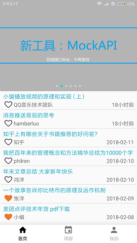
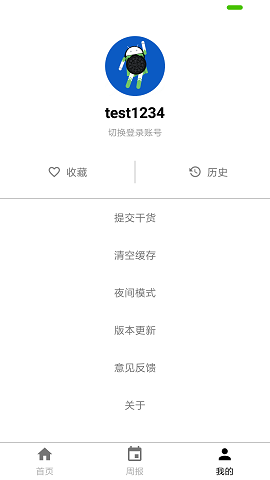

### DailyAndroid ：一个聚合“玩Android”，“干货营”，“Android周报”的客户端，基于kotlin编写。
---

### [戳我下载](https://github.com/bboylin/DailyAndroid/releases/download/v1.0.0/daily-android-1.0.0.apk)

项目基于kotlin编写，架构分presentation,data,domain三层。引用了以下第三方框架或者控件：
* [retrofit](https://github.com/square/retrofit)
* [RxJava+RxAndroid](https://github.com/ReactiveX/RxJava)
* [fresco](https://github.com/facebook/fresco)
* [UniversalToast](https://github.com/bboylin/UniversalToast)
* [bannerview](https://github.com/czy1121/bannerview)
* [FinestWebView](https://github.com/TheFinestArtist/FinestWebView-Android)
* [jsoup](https://jsoup.org)

致谢：
* [鸿洋大佬的玩Android](http://www.wanandroid.com/)
* [kotlinmvp](https://github.com/git-xuhao/KotlinMvp)
* [干货营](http://gank.io/)
* [AndroidWeekly](https://www.androidweekly.cn/)

to do list:

- [ ] 换肤
- [ ] 定制webView
- [ ] 换头像

欢迎通过issue提bug和建议.

# License

    Copyright 2018 bboylin

    Licensed under the Apache License, Version 2.0 (the "License");
    you may not use this file except in compliance with the License.
    You may obtain a copy of the License at

       http://www.apache.org/licenses/LICENSE-2.0

    Unless required by applicable law or agreed to in writing, software
    distributed under the License is distributed on an "AS IS" BASIS,
    WITHOUT WARRANTIES OR CONDITIONS OF ANY KIND, either express or implied.
    See the License for the specific language governing permissions and
    limitations under the License.